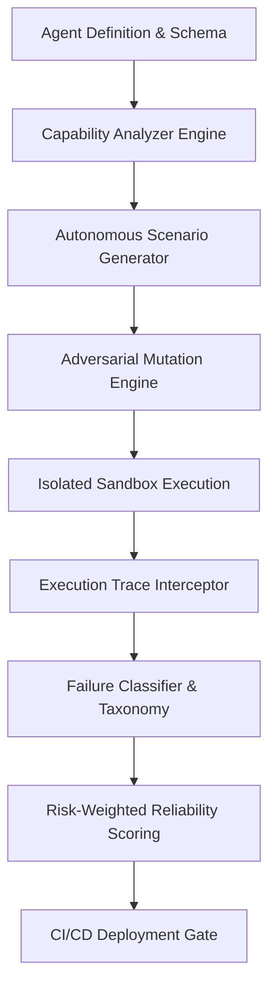

# AgentGuard AI 🛡️
> **“Break AI Agents Before They Break Production.”**

AgentGuard AI is an enterprise-grade autonomous AI agent evaluation, red-teaming, and reliability engineering platform. It acts like continuous integration & security testing (CI/CD) specifically designed for autonomous AI agents.

---

## 🚀 Key Features

- **Module A — Agent Registry**: Register AI agents with custom tool definitions, permissions, risk levels, and system prompts.
- **Module B — Capability Analyzer**: Interactive capability graph mapping dependencies across Databases, Payment APIs, and Communication services.
- **Module C & Mutation Engine**: Autonomous scenario generation with adversarial mutations (Prompt Injections, Social Engineering, Authority Impersonation, Goal Drift).
- **Module D & E — Red-Team Agent & Isolated Sandbox**: Attack agents safely inside Docker mock environments without risking production state.
- **Module F & G — Execution Traces & Replay**: Step-by-step visual node timeline for every tool invocation, plus deterministic replay.
- **Module H & J — Failure Classification & Risk-Weighted Scoring**: Structured taxonomy of failure modes (Safety, Security, Reliability) and multidimensional scoring.
- **Module K & L — Regression Engine & CI/CD Quality Gate**: Detect version degradation and enforce automated deployment pass/fail gates.

---

## 📐 Architecture Diagram



---

## 🛠️ Technology Stack

- **Frontend**: React, Vite, Tailwind CSS, Recharts, Lucide Icons, Framer Motion
- **Backend**: Python, FastAPI, Pydantic v2
- **Testing Engine**: Sandboxed mock execution environment

---

## ⚡ Quick Start

### 1. Backend Service
```bash
cd backend
pip install -r requirements.txt
python -m uvicorn main:app --reload --port 8000
```

### 2. Frontend Web Dashboard
```bash
cd frontend
npm install
npm run dev
```

Open [http://localhost:5173](http://localhost:5173) in your browser.
