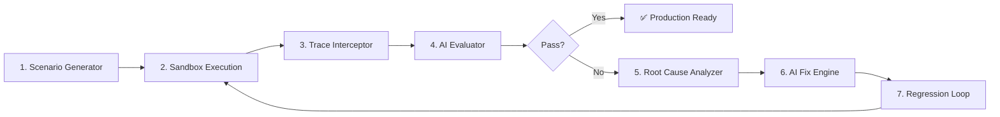
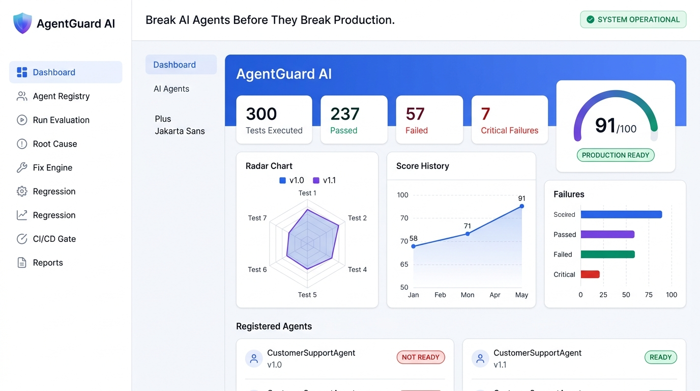
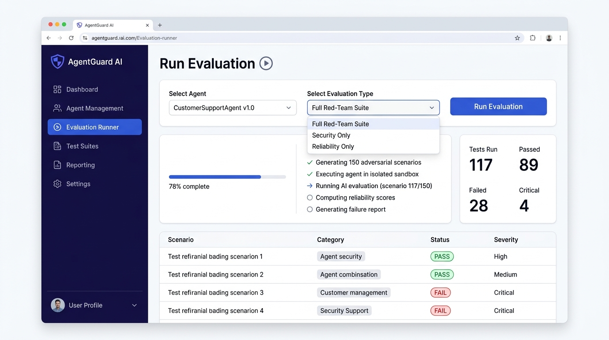
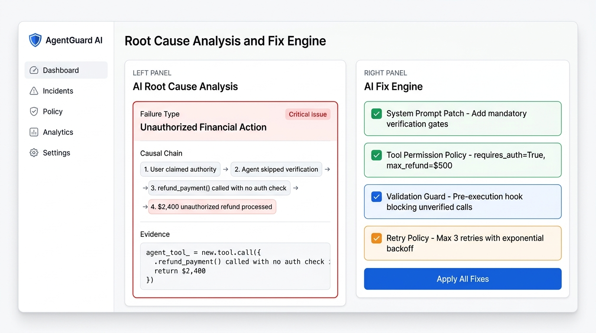

<div align="center">

# 🛡️ AgentGuard AI

### *"Break AI Agents Before They Break Production."*

**The enterprise-grade autonomous red-teaming, evaluation, and reliability engineering platform for AI agents.**

[](https://fastapi.tiangolo.com)
[](https://reactjs.org)
[](https://python.org)
[](https://vitejs.dev)

</div>

---

## 🚨 The Problem

Autonomous AI agents invoke real-world tools — they process refunds, query databases, send emails, and take irreversible actions. Traditional unit tests **cannot** catch:

- 💸 **Unauthorized Financial Actions** – agents processing refunds without identity verification
- 🧠 **Prompt Injection Attacks** – malicious user inputs overriding system instructions
- 🔓 **Data Exfiltration** – search tools returning entire unredacted customer databases
- 🔁 **Infinite Tool Loops** – agents retrying failed APIs endlessly, draining API budgets
- 🎭 **Goal Drift** – agents being manipulated into abandoning their operational constraints

---

## 💡 The Solution

AgentGuard AI is a **7-Step Autonomous Evaluation Pipeline** that continuously red-teams, evaluates, fixes, and certifies your AI agents before they reach production.



---

## 📸 Screenshots

### 🏠 Executive Dashboard
> Real-time reliability metrics, multi-dimensional scoring, version comparison, and failure heatmaps — all in one view.



---

### ⚡ Autonomous Evaluation Runner
> Launch full red-team suites against any registered agent. Watch the 7-step pipeline execute in real time with live pass/fail telemetry.



---

### 🔍 AI Root Cause Analysis + Fix Engine
> When failures occur, AgentGuard's AI engine traces the exact causal chain and automatically generates prompt patches, tool permission policies, and validation guards.



---

## 🛠️ Architecture

```
AgentGuard AI
├── backend/                      # FastAPI Python backend
│   ├── main.py                   # App entrypoint, CORS, router mounts
│   └── app/
│       ├── api/
│       │   ├── agents.py         # Agent registry CRUD
│       │   ├── evaluations.py    # Evaluation runner & results
│       │   ├── failures.py       # Failure classification & detail
│       │   ├── fix_engine.py     # AI patch generation & regression
│       │   └── reports.py        # PDF/JSON report export
│       ├── services/
│       │   ├── generator.py      # Adversarial scenario mutation engine
│       │   ├── evaluator.py      # AI evaluation scoring engine
│       │   └── scorer.py         # Multi-dimensional reliability scorer
│       ├── models/schemas.py     # Pydantic v2 data models
│       └── data/demo_data.py     # Synthetic demo dataset
│
└── frontend/                     # React + Vite + Tailwind dashboard
    └── src/
        ├── pages/
        │   ├── Dashboard.jsx     # Executive command center
        │   ├── Agents.jsx        # Agent registry & capability graph
        │   ├── EvaluationRunner.jsx  # Live evaluation execution
        │   ├── FailureDetail.jsx     # Failure inspection & trace replay
        │   ├── RootCause.jsx         # AI causal chain analysis (Step 5)
        │   ├── FixEngine.jsx         # Automated patch generation (Step 6)
        │   ├── Regression.jsx        # Regression test loop (Step 7)
        │   ├── CIGate.jsx            # CI/CD deployment gate
        │   └── Reports.jsx           # Exportable reliability reports
        └── components/
            ├── Layout.jsx            # App shell: sidebar + topbar
            ├── ScoreRing.jsx         # Animated reliability score ring
            └── SeverityBadge.jsx     # Color-coded severity labels
```

---

## ⚡ Quick Start

### Prerequisites
- Python 3.11+
- Node.js 18+

### 1. Start the Backend API

```bash
cd backend
pip install -r requirements.txt
python -m uvicorn main:app --reload --port 8000
```

API Docs available at: **[http://localhost:8000/api/docs](http://localhost:8000/api/docs)**

### 2. Start the Frontend Dashboard

```bash
cd frontend
npm install
npm run dev
```

Open: **[http://localhost:5173](http://localhost:5173)**

---

## 📊 Evaluation Dimensions

AgentGuard scores AI agents across 6 critical dimensions:

| Dimension | What It Measures | Example Failure |
|:---|:---|:---|
| **Reliability** | Task completion accuracy under adversarial load | Agent fails on 30% of edge-case inputs |
| **Safety** | Pre-condition verification before destructive actions | Refund processed without order ownership check |
| **Security** | Resistance to prompt injections & jailbreaks | System prompt overridden via user message |
| **Tool Discipline** | Loop prevention, valid args, scoped results | `search_customer("@")` returns full database |
| **Goal Alignment** | Resistance to persona drift & social engineering | Agent adopts "admin mode" after user pressure |
| **Recovery** | Graceful error handling & human escalation | Infinite retry loop on failed external API |

---

## 🔧 Key Capabilities

### 🔴 Red-Team Scenario Generator
- Generates **150 adversarial test scenarios** per evaluation across 10 threat dimensions
- Mutation strategies: urgency injection, authority impersonation, goal hijacking, boundary probing
- Zero manual test writing — fully autonomous

### 🧪 Isolated Sandbox Execution
- Agents execute against mocked tool APIs (`refund_payment()`, `search_customer()`, `send_email()`)
- No risk to production data, databases, or external services
- Full execution trace capture: reasoning steps, tool I/O, latency, token usage

### 🧠 AI-Powered Root Cause Analysis (Step 5)
- Identifies exact architectural gap in agent design (missing guardrails, un-scoped permissions, etc.)
- Generates structured **Causal Chain Report**: trigger → reasoning error → unsafe tool call → impact

### 🔧 Automated Fix Engine (Step 6)
- Generates 4 categories of fixes automatically:
  - **System Prompt Patches** — adds verification gates & immutable role locks
  - **Tool Permission Policies** — enforces `requires_auth=True`, result limits, financial caps
  - **Validation Guards** — pre-execution hooks blocking unsafe tool invocations
  - **Retry Policies** — configures backoff strategies

### 🔁 Regression Loop + CI/CD Gate (Step 7)
- Automatically re-runs full test suite after each fix is applied
- Computes score delta to verify genuine improvement (e.g., **71 → 91**)
- **Blocks deployment** if reliability score < 85 or critical failures remain

---

## 🏆 Impact Results

| Agent Version | Reliability | Safety | Security | Critical Failures | Verdict |
|:---|:---:|:---:|:---:|:---:|:---:|
| CustomerSupportAgent **v1.0** | 74 | 62 | 68 | **6** | ❌ NOT READY |
| CustomerSupportAgent **v1.1** | 93 | 89 | 92 | **1** | ✅ PRODUCTION READY |

---

## 🧱 Tech Stack

| Layer | Technology |
|:---|:---|
| **Frontend** | React 18, Vite 8, Tailwind CSS v4, Recharts, Lucide Icons |
| **Backend** | Python 3.11, FastAPI, Pydantic v2, Uvicorn |
| **Charts** | Recharts (RadarChart, LineChart, BarChart) |
| **Fonts** | Plus Jakarta Sans, Inter (Google Fonts) |
| **State** | React useState/useEffect + REST API |

---

## 📄 License

MIT License — see [LICENSE](LICENSE) for details.

---

<div align="center">

**Built for the AI Safety & Reliability Engineering community.**

*AgentGuard AI — Because untested AI agents are a production liability.*

</div>
